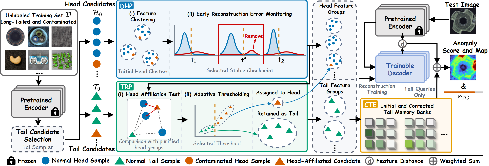

# TailGuard

Official implementation of **TailGuard: Progressive Reference Eligibility
Determination for Long-Tailed Noisy Industrial Anomaly Detection**.

TailGuard addresses unified industrial anomaly detection when an unlabeled
training set is both class imbalanced and contaminated. Instead of treating an
initial tail partition as a final decision, TailGuard progressively determines
whether uncertain samples may supervise reconstruction, whether their patch
features may enter normal memory, and whether that memory may support a test
query.



## Method

TailGuard consists of three dependent stages:

- **Dynamic Head Purification (DHP)** uses early reconstruction dynamics to identify and remove contamination from head candidates.
- **Tail Reconciliation and Preservation (TRP)** protects initial tail candidates and reconciles their assignments against the purified head structure.
- **Conditional Tail Enhancement (CTE)** constructs memories from the reconciled tail groups and applies their evidence only to matched queries.

The paper configuration uses a frozen DINOv2 ViT-B/14 encoder and the Dinomaly
reconstruction core. The canonical TailGuard parameters are centralized in
`tailguard/config.py`; the default `full` variant runs the complete method.

## Repository structure

```text
TailGuard
├── assets/                     # Pipeline and repository illustrations
├── main.py                     # CLI configuration and complete pipeline orchestration
├── build_datasets.sh           # Long-tailed noisy benchmark construction entry point
├── manifests/                  # Paper dataset construction manifests
├── tailguard/
│   ├── data/                   # Dataset readers, profiles, and manifest parsing
│   ├── engine/                 # Training pipeline and final evaluation
│   ├── method/                 # Tail sampling, DHP, TRP, CTE, and final score fusion
│   ├── models/                 # Encoder, decoder, and reconstruction model
│   ├── optimizers/             # Optimizer used by the paper configuration
│   ├── reporting/              # Artifact writers and post-hoc diagnostics
│   └── vendor/dinov2/          # Required DINOv2 architecture definitions
├── tools/                      # Dataset conversion and construction
└── requirements.txt
```

Datasets, pretrained weights, checkpoints, and generated results are not
stored in the repository. The DINOv2 checkpoint is downloaded from the
upstream host on first use.

## Environment

```bash
conda create -n tailguard python=3.8.12
conda activate tailguard
pip install -r requirements.txt
```

The paper experiments used PyTorch 1.12.0 and CUDA 11.3. Run the following
commands from the repository root.

## Data preparation

Download [MVTec AD](https://www.mvtec.com/company/research/datasets/mvtec-ad)
and [VisA](https://github.com/amazon-science/spot-diff). Convert VisA to the
MVTec AD layout before constructing the benchmark:

```bash
python tools/convert_visa_to_mvtec_format.py \
  --source_dir ../VisA \
  --target_dir ../VisA_pytorch/1cls
```

Build the long-tailed noisy datasets with the provided manifests:

```bash
bash build_datasets.sh \
  ../mvtec_anomaly_detection \
  ../tailguard_datasets \
  mvtecad-nlt

bash build_datasets.sh \
  ../VisA_pytorch/1cls \
  ../tailguard_datasets \
  visa-nlt
```

## Training and evaluation

MVTec AD:

```bash
python main.py \
  --dataset_profile mvtec \
  --data_path ../tailguard_datasets/mvtecad-step_k4-seed01 \
  --gpu 0
```

VisA:

```bash
python main.py \
  --dataset_profile visa \
  --data_path ../tailguard_datasets/visa-step_k4-seed01 \
  --gpu 0
```

The default configuration runs the complete TailGuard pipeline. Results are
saved under `saved_results/`.

## Citation

The citation will be added after the paper becomes publicly available.

## Acknowledgments

TailGuard is implemented on top of
[Dinomaly](https://github.com/guojiajeremy/Dinomaly) and uses architecture
definitions from [DINOv2](https://github.com/facebookresearch/dinov2).
