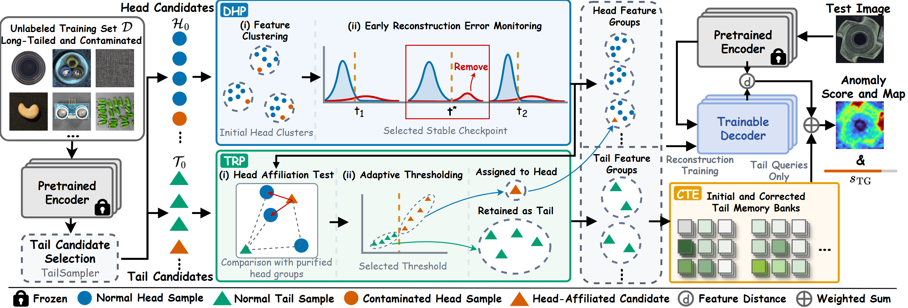

# TailGuard

Official implementation of **TailGuard: Progressive Reference Eligibility
Determination for Long-Tailed Noisy Industrial Anomaly Detection**.

TailGuard addresses unified industrial anomaly detection when an unlabeled
training set is both class imbalanced and contaminated. Instead of treating an
initial tail partition as a final decision, TailGuard progressively determines
whether uncertain samples may supervise reconstruction, whether their patch
features may enter normal memory, and whether that memory may support a test
query.



## Method

TailGuard consists of three dependent stages:

- **Dynamic Head Purification (DHP)** uses early reconstruction dynamics to identify and remove contamination from head candidates.
- **Tail Reconciliation and Preservation (TRP)** protects initial tail candidates and reconciles their assignments against the purified head structure.
- **Conditional Tail Enhancement (CTE)** constructs memories from the reconciled tail groups and applies their evidence only to matched queries.

The paper configuration uses a frozen DINOv2 ViT-B/14 encoder and the Dinomaly
reconstruction core. The canonical TailGuard parameters are centralized in
`tailguard/config.py`; the default `full` variant runs the complete method.

## Supplementary material

The ICASSP paper presents the central method and results within the four-page
technical-content limit. The repository provides a
[web supplement](docs/supplementary/) with:

- complete method and implementation details;
- head, tail, and overall results;
- the full prediction-distinct component comparison;
- quantitative motivation and mechanism analyses;
- CTE storage cost and qualitative sample scores;
- machine-readable CSV versions of every supplementary table.

The supplement documents the frozen paper method only; exploratory variants
and rejected calibration trials are not included.

## Repository structure

```text
TailGuard
├── assets/                     # Pipeline and repository illustrations
├── docs/supplementary/         # Web supplement and machine-readable tables
├── main.py                     # CLI configuration and complete pipeline orchestration
├── build_datasets.sh           # Long-tailed noisy benchmark construction entry point
├── manifests/                  # Paper dataset construction manifests
├── tailguard/
│   ├── data/                   # Dataset readers, profiles, and manifest parsing
│   ├── engine/                 # Training pipeline and final evaluation
│   ├── method/                 # Tail sampling, DHP, TRP, CTE, and final score fusion
│   ├── models/                 # Encoder, decoder, and reconstruction model
│   ├── optimizers/             # Optimizer used by the paper configuration
│   ├── reporting/              # Artifact writers and post-hoc diagnostics
│   └── vendor/dinov2/          # Required DINOv2 architecture definitions
├── tools/                      # Dataset conversion and construction
└── requirements.txt
```

Datasets, pretrained weights, checkpoints, and generated results are not
stored in the repository. The DINOv2 checkpoint is downloaded from the
upstream host on first use.

## Environment

```bash
conda create -n tailguard python=3.8.12
conda activate tailguard
pip install -r requirements.txt
```

The paper experiments used PyTorch 1.12.0 and CUDA 11.3. Run the following
commands from the repository root.

## Data preparation

### MVTec AD

Download [MVTec AD](https://www.mvtec.com/company/research/datasets/mvtec-ad)
and extract it to `../mvtec_anomaly_detection`. Build the long-tailed noisy
constructions with the provided manifests:

```bash
bash build_datasets.sh \
  ../mvtec_anomaly_detection \
  ../tailguard_datasets \
  mvtecad-nlt
```

This builds the MVTec AD `pareto`, `step_k4`, and `step_k1` settings for
`seed01` through `seed05`. To build only Step-K1 seed01, run:

```bash
bash build_datasets.sh \
  ../mvtec_anomaly_detection \
  ../tailguard_datasets \
  mvtecad-nlt step_k1 seed01
```

### VisA

Download [VisA](https://github.com/amazon-science/spot-diff) and extract it to
`../visa`. First convert it to the MVTec AD directory layout:

```bash
python tools/convert_visa_to_mvtec_format.py \
  --source_dir ../visa \
  --target_dir ../visa_pytorch/1cls
```

Then build the long-tailed noisy constructions with the VisA manifests:

```bash
bash build_datasets.sh \
  ../visa_pytorch/1cls \
  ../tailguard_datasets \
  visa-nlt
```

This builds the VisA `pareto`, `step_k4`, and `step_k1` settings for `seed01`
through `seed05`. To build one construction, append the setting and seed, for
example `visa-nlt step_k1 seed01` instead of `visa-nlt` in the command above.

## Training and evaluation

MVTec AD:

```bash
python main.py \
  --dataset_profile mvtec \
  --data_path ../tailguard_datasets/mvtecad-step_k4-seed01 \
  --save_name mvtecad-step_k4-seed01 \
  --gpu 0
```

VisA:

```bash
python main.py \
  --dataset_profile visa \
  --data_path ../tailguard_datasets/visa-step_k4-seed01 \
  --save_name visa-step_k4-seed01 \
  --gpu 0
```

To run another construction, replace `--data_path` with the directory built
for that dataset, setting, and seed: `mvtecad-<setting>-<seed>` for MVTec AD or
`visa-<setting>-<seed>` for VisA. Use `pareto`, `step_k4`, or `step_k1` as the
setting and `seed01` through `seed05` as the seed. Keep `--dataset_profile`
matched to the dataset (`mvtec` or `visa`), and change `--save_name` to a
different name for each run so its results are stored separately. For example,
to evaluate MVTec AD Step-K1 seed03, use
`--data_path ../tailguard_datasets/mvtecad-step_k1-seed03 --save_name mvtecad-step_k1-seed03`.

The default configuration runs the complete TailGuard pipeline. A successful
run saves the final model, two reference memories, compact train/test audit
tables, metrics, and one run summary under `saved_results/`.

## Citation

The citation will be added after the paper becomes publicly available.

## Acknowledgments

TailGuard is implemented on top of
[Dinomaly](https://github.com/guojiajeremy/Dinomaly) and uses architecture
definitions from [DINOv2](https://github.com/facebookresearch/dinov2).
